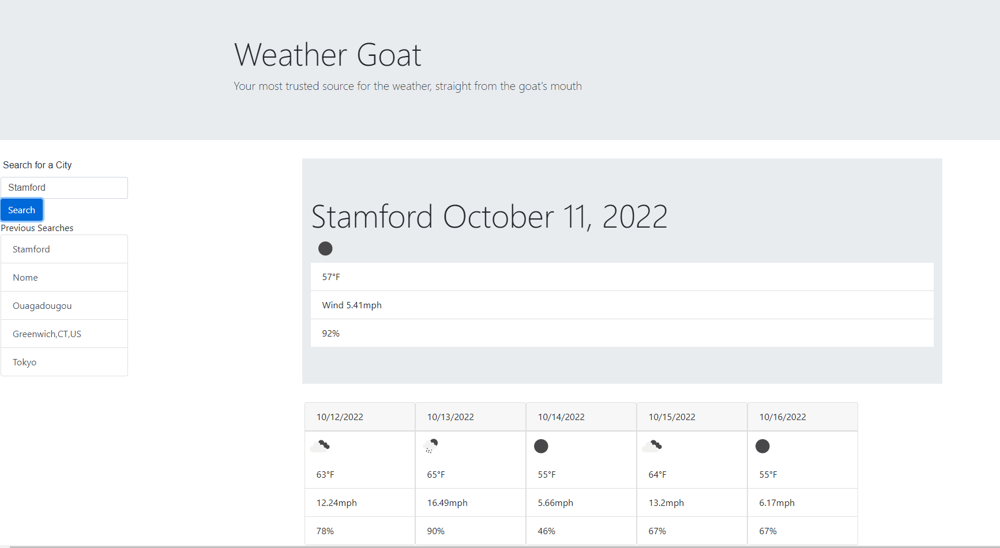

# Weather Dashboard

## Summary

This project sets out to create an app that provides current weather and a 5 day weather forecast for any city it is given. The app uses the OpenWeather "Current Weather Data" and "5 Day/3 Hour Forecast" APIs to retrieve the weather data. The app will also use local storage to record the 5 most recent cities looked up. That history is displayed beneath the search bar, with a button for each recent search.

The application makes use of the jQuery and Momentjs libraries, as well as Bootstrap for formatting.

The 5 day forecast returned is based on the weather data approximately 24, 48, 72, 96, and 120 hours (+/- 1.5hrs) from the current time at the moment the search button is pressed and the API is called. In future updates, I plan to use the momentjs library more effectively to provide 5 day forecasts from noon specifically each day. Progress on this can be tracked in the "adjusting-timestamps" branch

The live site can be accessed at: https://dbanfieldkeller.github.io/Weather-Dashboard/

When viewed the page should appear as below: